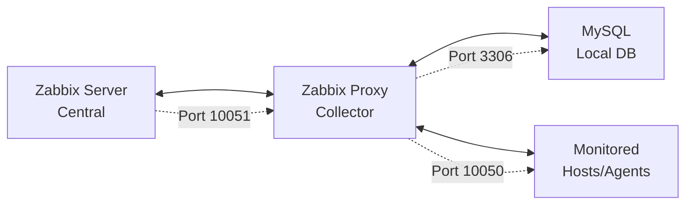

📊 Zabbix Proxy 7.0 LTS - Manual de Instalação

[](https://www.zabbix.com/)
[](https://www.mysql.com/)
[](https://ubuntu.com/)
[](LICENSE)

> **Manual Técnico**: Implementação completa de Zabbix Proxy 7.0 LTS + MySQL no Ubuntu Server 24.04 LTS

## 📋 Índice

- [🎯 Objetivo e Pré-requisitos](#-objetivo-e-pré-requisitos)
- [🚀 Preparação do Ambiente](#-preparação-do-ambiente)
- [🔧 Instalação dos Componentes](#-instalação-dos-componentes)
- [🗄️ Configuração do Banco de Dados](#️-configuração-do-banco-de-dados)
- [⚙️ Configuração do Zabbix Proxy](#️-configuração-do-zabbix-proxy)
- [🚀 Inicialização dos Serviços](#-inicialização-dos-serviços)
- [✅ Verificações Pós-Instalação](#-verificações-pós-instalação)
- [🔗 Configuração no Zabbix Server](#-configuração-no-zabbix-server)
- [🔥 Configuração de Firewall](#-configuração-de-firewall)
- [📊 Monitoramento e Troubleshooting](#-monitoramento-e-troubleshooting)
- [🛠️ Manutenção](#️-manutenção)
- [📚 Referências](#-referências)

## 🎯 Objetivo e Pré-requisitos

### Objetivo

Implementar um Zabbix Proxy para distribuir a carga de monitoramento e melhorar a performance em ambientes distribuídos, proporcionando coleta de dados local e sincronização com o Zabbix Server central.

### Pré-requisitos

| Componente | Especificação |
|------------|---------------|
| **Sistema Operacional** | Ubuntu Server 24.04 LTS |
| **RAM** | Mínimo 1GB (Recomendado 2GB+) |
| **CPU** | Mínimo 1 vCPU (Recomendado 2+) |
| **Storage** | Mínimo 10GB (Recomendado 20GB+) |
| **Acesso** | Root ou usuário com sudo |
| **Conectividade** | Internet + acesso ao Zabbix Server |
| **Portas** | 10051 (proxy), 3306 (mysql) |

### Arquitetura da Solução



## 🚀 Preparação do Ambiente

### Instalar Dependências Básicas

```bash
# Atualizar sistema e instalar ferramentas essenciais
sudo apt update && sudo apt upgrade -y
sudo apt install -y wget curl gnupg2 lsb-release software-properties-common
```

### Configurar Repositório Zabbix

```bash
# Download e instalação do repositório oficial
wget https://repo.zabbix.com/zabbix/7.0/ubuntu/pool/main/z/zabbix-release/zabbix-release_latest_7.0+ubuntu24.04_all.deb
sudo dpkg -i zabbix-release_latest_7.0+ubuntu24.04_all.deb
sudo apt update
```

## 🔧 Instalação dos Componentes

### Instalar MySQL Server

```bash
# Instalação do MySQL Server
sudo apt install -y mysql-server mysql-client

# Executar configuração segura do MySQL
sudo mysql_secure_installation
```

> **⚠️ Configurações recomendadas durante mysql_secure_installation:**
> - Validate Password Plugin: **Y** (Yes)
> - Password Validation Policy: **2** (STRONG)
> - Remove anonymous users: **Y** (Yes)
> - Disallow root login remotely: **Y** (Yes)
> - Remove test database: **Y** (Yes)
> - Reload privilege tables: **Y** (Yes)

### Instalar Zabbix Proxy e Dependências

```bash
# Instalação do Zabbix Proxy com MySQL
sudo apt install -y zabbix-proxy-mysql zabbix-sql-scripts zabbix-agent2
```

### Instalar Plugins do Zabbix Agent 2 (Opcional)

```bash
# Plugins para monitoramento avançado local
sudo apt install -y zabbix-agent2-plugin-mongodb \\
                    zabbix-agent2-plugin-mysql \\
                    zabbix-agent2-plugin-postgresql
```

## 🗄️ Configuração do Banco de Dados

### Configurar MySQL para Zabbix Proxy

```bash
# Acessar MySQL como root
sudo mysql -u root -p
```

### Criar Banco e Usuário para Proxy

```sql
-- Criar banco de dados para o proxy
CREATE DATABASE zabbix_proxy CHARACTER SET utf8mb4 COLLATE utf8mb4_bin;

-- Criar usuário para o proxy
CREATE USER 'zabbix_proxy'@'localhost' IDENTIFIED BY 'SuaSenhaSeguraAqui';

-- Conceder privilégios
GRANT ALL PRIVILEGES ON zabbix_proxy.* TO 'zabbix_proxy'@'localhost';

-- Aplicar mudanças
FLUSH PRIVILEGES;

-- Verificar criação
SHOW DATABASES LIKE 'zabbix_proxy';
SELECT User, Host FROM mysql.user WHERE User = 'zabbix_proxy';

-- Sair do MySQL
EXIT;
```

### Importar Schema do Zabbix Proxy

```bash
# Importar estrutura inicial do proxy
zcat /usr/share/zabbix-sql-scripts/mysql/proxy.sql.gz | mysql -u zabbix_proxy -p zabbix_proxy
```

### Otimizar Configuração do MySQL

```bash
# Editar configuração do MySQL
sudo nano /etc/mysql/mysql.conf.d/mysqld.cnf
```

Adicionar as seguintes configurações na seção **[mysqld]**:

```ini
# Configurações otimizadas para Zabbix Proxy
innodb_buffer_pool_size = 256M
innodb_log_file_size = 64M
innodb_log_buffer_size = 16M
innodb_flush_log_at_trx_commit = 2
innodb_flush_method = O_DIRECT

# Configurações de conexão
max_connections = 200
wait_timeout = 28800
interactive_timeout = 28800

# Configurações de cache
query_cache_size = 64M
query_cache_type = 1
query_cache_limit = 4M

# Configurações de log
slow_query_log = 1
slow_query_log_file = /var/log/mysql/slow.log
long_query_time = 2

# Configurações de charset
character-set-server = utf8mb4
collation-server = utf8mb4_bin
```

### Reiniciar MySQL

```bash
# Reiniciar MySQL para aplicar configurações
sudo systemctl restart mysql
sudo systemctl enable mysql
```

## ⚙️ Configuração do Zabbix Proxy

### Editar Configuração Principal

```bash
# Fazer backup da configuração
sudo cp /etc/zabbix/zabbix_proxy.conf /etc/zabbix/zabbix_proxy.conf.backup

# Editar arquivo de configuração
sudo nano /etc/zabbix/zabbix_proxy.conf
```

### Configurações Obrigatórias

```ini
# Configurações do Proxy
ProxyMode=0                    # 0=active, 1=passive
Server=IP_DO_ZABBIX_SERVER    # IP do seu Zabbix Server
ServerPort=10051
Hostname=NOME_DO_PROXY        # Nome único para identificar o proxy

# Configurações de Rede
ListenPort=10051
ListenIP=0.0.0.0

# Configurações do Banco de Dados MySQL
DBHost=localhost
DBName=zabbix_proxy
DBUser=zabbix_proxy
DBPassword=SuaSenhaSeguraAqui
DBPort=3306
DBSocket=/var/run/mysqld/mysqld.sock

# Configurações de Performance
StartPollers=5
StartPollersUnreachable=1
StartTrappers=5
StartPingers=1
StartDiscoverers=1
StartHTTPPollers=1

# Configurações de Cache
CacheSize=32M
HistoryCacheSize=16M
HistoryIndexCacheSize=4M
TrendCacheSize=4M
ValueCacheSize=8M

# Configurações de Timeout
Timeout=4
TrapperTimeout=300
UnreachablePeriod=45
UnavailableDelay=60
UnreachableDelay=15

# Configurações de Log
LogFile=/var/log/zabbix/zabbix_proxy.log
LogFileSize=10
DebugLevel=3

# Configurações de Dados
ProxyLocalBuffer=0
ProxyOfflineBuffer=1
HeartbeatFrequency=60
ConfigFrequency=3600
DataSenderFrequency=1
```

### Configurar Permissões

```bash
# Criar diretório de log se não existir
sudo mkdir -p /var/log/zabbix
sudo chown zabbix:zabbix /var/log/zabbix

# Ajustar permissões do arquivo de configuração
sudo chown zabbix:zabbix /etc/zabbix/zabbix_proxy.conf
sudo chmod 640 /etc/zabbix/zabbix_proxy.conf
```

## 🚀 Inicialização dos Serviços

### Iniciar e Habilitar Serviços

```bash
# Reiniciar todos os serviços
sudo systemctl restart zabbix-proxy zabbix-agent2 mysql

# Habilitar inicialização automática
sudo systemctl enable zabbix-proxy zabbix-agent2 mysql
```

## ✅ Verificações Pós-Instalação

### Status dos Serviços

```bash
# Verificar se todos os serviços estão ativos
sudo systemctl status zabbix-proxy zabbix-agent2 mysql
```

### Verificar Logs do Proxy

```bash
# Verificar logs em tempo real
sudo tail -f /var/log/zabbix/zabbix_proxy.log

# Verificar últimas 50 linhas
sudo tail -50 /var/log/zabbix/zabbix_proxy.log
```

### Testar Conectividade

```bash
# Verificar portas em uso
sudo netstat -tlnp | grep -E \"(10051|3306)\"

# Testar conexão com banco local
mysql -u zabbix_proxy -p -e \"SELECT VERSION();\" zabbix_proxy

# Testar conectividade com Zabbix Server
telnet IP_DO_ZABBIX_SERVER 10051
```

### Verificar Configuração

```bash
# Testar configuração do proxy
sudo zabbix_proxy -c /etc/zabbix/zabbix_proxy.conf -t
```

## 🔗 Configuração no Zabbix Server

### Adicionar Proxy na Interface Web

1. **Acesse a interface web do Zabbix Server**
   - URL: `http://IP_DO_ZABBIX_SERVER`

2. **Navegue para Administration > Proxies**

3. **Clique em \"Create proxy\"**

4. **Configure os seguintes parâmetros:**
   - **Proxy name**: `NOME_DO_PROXY` (mesmo nome do arquivo de configuração)
   - **Proxy mode**: `Active`
   - **Proxy address**: (deixe vazio para proxy ativo)
   - **Description**: `Proxy Ubuntu 24.04 + MySQL`

5. **Clique em \"Add\"**

### Verificar Status do Proxy

```bash
# No servidor proxy, verificar se está conectando
sudo grep -i \"sending heartbeat\" /var/log/zabbix/zabbix_proxy.log

# Verificar se está recebendo configuração
sudo grep -i \"received configuration\" /var/log/zabbix/zabbix_proxy.log
```

## 🔥 Configuração de Firewall

### Configurar UFW (Ubuntu Firewall)

```bash
# Habilitar UFW se não estiver ativo
sudo ufw enable

# Permitir SSH (importante!)
sudo ufw allow ssh

# Permitir conexão com Zabbix Server
sudo ufw allow out 10051/tcp

# Permitir conexões de agents locais
sudo ufw allow 10051/tcp

# Permitir MySQL local
sudo ufw allow from 127.0.0.1 to any port 3306

# Verificar status
sudo ufw status verbose
```

## 📊 Monitoramento e Troubleshooting

### Comandos Úteis para Diagnóstico

```bash
# Verificar status detalhado do proxy
sudo systemctl status zabbix-proxy -l

# Monitorar logs em tempo real
sudo journalctl -u zabbix-proxy -f

# Verificar uso de recursos
top -p $(pgrep zabbix_proxy)

# Verificar conexões de rede
sudo ss -tulpn | grep 10051

# Verificar espaço em disco
df -h /var/log/zabbix/
```

### Principais Problemas e Soluções

| Problema | Possível Causa | Solução |
|----------|----------------|---------|
| Proxy não conecta ao Server | Firewall/IP incorreto | Verificar UFW e conectividade |
| Erro de banco MySQL | Credenciais incorretas | Verificar DBUser/DBPassword |
| Alto uso de CPU | Cache insuficiente | Aumentar CacheSize |
| Logs com erro de timeout | Timeout muito baixo | Aumentar Timeout |
| MySQL lento | Configuração não otimizada | Ajustar innodb_buffer_pool_size |

### Script de Monitoramento

```bash
#!/bin/bash
# Script para monitorar performance do MySQL

echo \"=== MySQL Status ===\"
mysql -u zabbix_proxy -p -e \"
SELECT 
    VARIABLE_NAME, 
    VARIABLE_VALUE 
FROM INFORMATION_SCHEMA.GLOBAL_STATUS 
WHERE VARIABLE_NAME IN (
    'Threads_connected',
    'Queries',
    'Slow_queries',
    'Uptime'
);\"

echo \"=== Zabbix Proxy Tables ===\"
mysql -u zabbix_proxy -p zabbix_proxy -e \"
SELECT 
    TABLE_NAME,
    ROUND(((DATA_LENGTH + INDEX_LENGTH) / 1024 / 1024), 2) AS 'Size (MB)'
FROM INFORMATION_SCHEMA.TABLES 
WHERE TABLE_SCHEMA = 'zabbix_proxy'
ORDER BY (DATA_LENGTH + INDEX_LENGTH) DESC
LIMIT 10;\"
```

## 🛠️ Manutenção

### Script de Backup

```bash
#!/bin/bash
# Script de backup do banco do proxy

BACKUP_DIR=\"/backup/zabbix-proxy\"
DATE=$(date +%Y%m%d_%H%M%S)
DB_USER=\"zabbix_proxy\"
DB_NAME=\"zabbix_proxy\"

mkdir -p $BACKUP_DIR

# Backup do banco
mysqldump -u $DB_USER -p $DB_NAME > $BACKUP_DIR/zabbix_proxy_$DATE.sql
gzip $BACKUP_DIR/zabbix_proxy_$DATE.sql

# Backup da configuração
cp /etc/zabbix/zabbix_proxy.conf $BACKUP_DIR/zabbix_proxy_conf_$DATE.backup

# Manter apenas últimos 7 backups
find $BACKUP_DIR -name \"*.sql.gz\" -mtime +7 -delete
find $BACKUP_DIR -name \"*.backup\" -mtime +7 -delete

echo \"Backup concluído: $BACKUP_DIR/zabbix_proxy_$DATE.sql.gz\"
```

### Configurar Logrotate

```bash
# Configurar logrotate para Zabbix Proxy
sudo nano /etc/logrotate.d/zabbix-proxy
```

```bash
/var/log/zabbix/zabbix_proxy.log {
    daily
    rotate 7
    compress
    delaycompress
    missingok
    notifempty
    create 0644 zabbix zabbix
    postrotate
        /bin/systemctl reload zabbix-proxy
    endscript
}
```

### Comandos de Manutenção

```bash
# Verificar tamanho do banco
mysql -u zabbix_proxy -p zabbix_proxy -e \"
SELECT 
    ROUND(SUM(DATA_LENGTH + INDEX_LENGTH) / 1024 / 1024, 1) AS 'DB Size in MB' 
FROM INFORMATION_SCHEMA.TABLES 
WHERE TABLE_SCHEMA = 'zabbix_proxy';\"

# Limpar dados antigos (executar com cuidado)
mysql -u zabbix_proxy -p zabbix_proxy -e \"
DELETE FROM proxy_history WHERE clock < UNIX_TIMESTAMP(DATE_SUB(NOW(), INTERVAL 7 DAY));\"

# Otimizar tabelas
mysql -u zabbix_proxy -p zabbix_proxy -e \"OPTIMIZE TABLE proxy_history;\"
```

## 📚 Referências

- [Documentação Oficial Zabbix 7.0](https://www.zabbix.com/documentation/7.0/)
- [Zabbix Proxy Documentation](https://www.zabbix.com/documentation/7.0/en/manual/concepts/proxy)
- [MySQL 8.0 Documentation](https://dev.mysql.com/doc/refman/8.0/en/)
- [Ubuntu Server 24.04 LTS Documentation](https://ubuntu.com/server/docs)

---

**✅ Instalação Concluída!**

O Zabbix Proxy 7.0 LTS com MySQL no Ubuntu Server 24.04 LTS está pronto para coletar dados e sincronizar com o Zabbix Server central.

> **💡 Dica**: Monitore os logs regularmente e ajuste as configurações conforme necessário para otimizar a performance.
