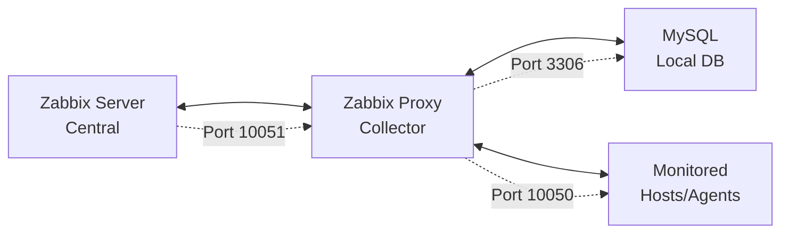

📊 Zabbix Proxy 7.0 LTS - Manual de Instalação

[](https://www.zabbix.com/)
[](https://www.mysql.com/)
[](https://ubuntu.com/)

> **Manual Técnico**: Implementação completa de Zabbix Proxy 7.0 LTS + MySQL no Ubuntu Server 24.04 LTS

## 📋 Índice

- [🎯 Objetivo e Pré-requisitos](#-objetivo-e-pré-requisitos)
- [🚀 Preparação do Ambiente](#-preparação-do-ambiente)
- [🔧 Instalação dos Componentes](#-instalação-dos-componentes)
- [🗄️ Configuração do Banco de Dados](#️-configuração-do-banco-de-dados)
- [⚙️ Configuração do Zabbix Proxy](#️-configuração-do-zabbix-proxy)
- [🚀 Inicialização dos Serviços](#-inicialização-dos-serviços)
- [✅ Verificações Pós-Instalação](#-verificações-pós-instalação)
- [🔗 Configuração no Zabbix Server](#-configuração-no-zabbix-server)
- [🔥 Configuração de Firewall](#-configuração-de-firewall)
- [📊 Monitoramento e Troubleshooting](#-monitoramento-e-troubleshooting)
- [🛠️ Manutenção](#️-manutenção)
- [📚 Referências](#-referências)

## 🎯 Objetivo e Pré-requisitos

### Objetivo

Implementar um Zabbix Proxy para distribuir a carga de monitoramento e melhorar a performance em ambientes distribuídos, proporcionando coleta de dados local e sincronização com o Zabbix Server central.

### Pré-requisitos

| Componente | Especificação |
|------------|---------------|
| **Sistema Operacional** | Ubuntu Server 24.04 LTS |
| **RAM** | Mínimo 1GB (Recomendado 2GB+) |
| **CPU** | Mínimo 1 vCPU (Recomendado 2+) |
| **Storage** | Mínimo 10GB (Recomendado 20GB+) |
| **Acesso** | Root ou usuário com sudo |
| **Conectividade** | Internet + acesso ao Zabbix Server |
| **Portas** | 10051 (proxy), 3306 (mysql) |

### Arquitetura da Solução



## 🚀 Preparação do Ambiente

### Atualização do sistema
```bash
# Atualizar lista de pacotes e sistema
sudo apt update && sudo apt upgrade -y

# Verificar versão do sistema
lsb_release -a
```

### Instalar Dependências

```bash
# Instalar ferramentas essenciais
sudo apt install -y wget curl gnupg2 lsb-release software-properties-common
```

### Configurar Repositório Zabbix

```bash
# Download do pacote de release do Zabbix 7.0
wget https://repo.zabbix.com/zabbix/7.0/ubuntu/pool/main/z/zabbix-release/zabbix-release_latest_7.0+ubuntu24.04_all.deb

# Instalação do repositório
sudo dpkg -i zabbix-release_latest_7.0+ubuntu24.04_all.deb

# Atualização do cache de pacotes
sudo apt update

# Limpeza do arquivo temporário
rm zabbix-release_latest_7.0+ubuntu24.04_all.deb
```

## 🔧 Instalação dos Componentes

### Instalar MySQL Server

```bash
# Instalação do MySQL Server e cliente
sudo apt install -y mysql-server mysql-client

# Verificar status do serviço
sudo systemctl status mysql
```

### Configuração de Segurança do MySQL
```bash
# Executar script de configuração segura
sudo mysql_secure_installation
```

> **⚠️ Configurações recomendadas durante mysql_secure_installation:**
> - Validate Password Plugin: **Y** (Yes)
> - Password Validation Policy: **2** (STRONG)
> - Remove anonymous users: **Y** (Yes)
> - Disallow root login remotely: **Y** (Yes)
> - Remove test database: **Y** (Yes)
> - Reload privilege tables: **Y** (Yes)

### Instalar Zabbix Proxy e Dependências

```bash
## Instalação dos componentes principais
sudo apt install -y \
    zabbix-proxy-mysql \
    zabbix-sql-scripts \
    zabbix-agent2

# Verificar versões instaladas
zabbix_proxy --version
zabbix_agent2 --version
```

## 🗄️ Configuração do Banco de Dados

### Configurar MySQL para Zabbix Proxy

```bash
# Acessar MySQL como root
sudo mysql -u root -p
```

### Criar Banco e Usuário para Proxy

```sql
-- Criar banco de dados com charset correto
CREATE DATABASE zabbix_proxy CHARACTER SET utf8mb4 COLLATE utf8mb4_bin;

-- Criar usuário específico para o proxy
-- ⚠️ SUBSTITUA 'SuaSenhaSeguraAqui' por uma senha forte
CREATE USER 'zabbix_proxy'@'localhost' IDENTIFIED BY '@dmin123';

-- Conceder privilégios necessários
GRANT ALL PRIVILEGES ON zabbix_proxy.* TO 'zabbix_proxy'@'localhost';

-- Aplicar mudanças
FLUSH PRIVILEGES;

-- Verificar criação
SHOW DATABASES LIKE 'zabbix_proxy';
SELECT User, Host FROM mysql.user WHERE User = 'zabbix_proxy';

-- Sair do MySQL
EXIT;
```

### Importar Schema do Zabbix Proxy

```bash
# Importar schema inicial do Zabbix Proxy
cat /usr/share/zabbix-sql-scripts/mysql/proxy.sql | mysql --default-character-set=utf8mb4 -uzabbix_proxy -p zabbix_proxy

# Verificar importação
mysql -u zabbix_proxy -p zabbix_proxy -e "SHOW TABLES;"
```

### Otimizar Configuração do MySQL

```bash
# Backup da configuração original
sudo cp /etc/mysql/mysql.conf.d/mysqld.cnf /etc/mysql/mysql.conf.d/mysqld.cnf.backup

# Editar configuração
sudo nano /etc/mysql/mysql.conf.d/mysqld.cnf
```

Adicionar as seguintes configurações na seção **[mysqld]**:

```ini
[mysqld]
# Configurações de performance
innodb_buffer_pool_size = 512M          # 50-70% da RAM disponível
innodb_log_file_size = 64M
innodb_log_buffer_size = 16M
innodb_flush_log_at_trx_commit = 2       # Performance vs. durabilidade
innodb_flush_method = O_DIRECT

# Configurações de conexão
max_connections = 200
wait_timeout = 28800
interactive_timeout = 28800

# Configurações de log para troubleshooting
slow_query_log = 1
slow_query_log_file = /var/log/mysql/slow.log
long_query_time = 2

# Configurações de charset
character-set-server = utf8mb4
collation-server = utf8mb4_bin

# Configurações de segurança
bind-address = 127.0.0.1                # Apenas conexões locais
```

### Reiniciar MySQL

```bash
# Reiniciar MySQL para aplicar configurações
sudo systemctl restart mysql
sudo systemctl enable mysql

# Verificar status
sudo systemctl status mysql
```

## ⚙️ Configuração do Zabbix Proxy

### Editar Configuração Principal

```bash
# Backup da configuração original
sudo cp /etc/zabbix/zabbix_proxy.conf /etc/zabbix/zabbix_proxy.conf.backup

# Editar configuração
sudo nano /etc/zabbix/zabbix_proxy.conf
```

### Configurações Obrigatórias

```ini
# === CONFIGURAÇÕES BÁSICAS ===
ProxyMode=0                              # 0=ativo, 1=passivo
Server=IP_DO_ZABBIX_SERVER              # ⚠️ SUBSTITUIR pelo IP real
ServerPort=10051
Hostname=NOME_DO_PROXY                  # ⚠️ SUBSTITUIR por nome único

# === CONFIGURAÇÕES DE REDE ===
ListenPort=10051
ListenIP=0.0.0.0

# === CONFIGURAÇÕES DO BANCO DE DADOS ===
DBHost=localhost
DBName=zabbix_proxy
DBUser=zabbix_proxy
DBPassword=SuaSenhaSeguraAqui           # ⚠️ SUBSTITUIR pela senha real
DBPort=3306
DBSocket=/var/run/mysqld/mysqld.sock

# === CONFIGURAÇÕES DE PERFORMANCE ===
StartPollers=10                         # Processos para coleta de dados
StartPollersUnreachable=2               # Processos para hosts inalcançáveis
StartTrappers=5                         # Processos para trapper items
StartPingers=1                          # Processos para ping ICMP
StartDiscoverers=1                      # Processos para descoberta
StartHTTPPollers=1                      # Processos para monitoramento HTTP

# === CONFIGURAÇÕES DE CACHE ===
CacheSize=64M                           # Cache de configuração
HistoryCacheSize=32M                    # Cache de histórico
HistoryIndexCacheSize=8M                # Cache de índice de histórico
TrendCacheSize=8M                       # Cache de tendências
ValueCacheSize=16M                      # Cache de valores

# === CONFIGURAÇÕES DE TIMEOUT ===
Timeout=4                               # Timeout para operações de rede
TrapperTimeout=300                      # Timeout para trappers
UnreachablePeriod=45                    # Período para host inalcançável
UnavailableDelay=60                     # Delay para host indisponível
UnreachableDelay=15                     # Delay para re-verificação

# === CONFIGURAÇÕES DE LOG ===
LogFile=/var/log/zabbix/zabbix_proxy.log
LogFileSize=10                          # Tamanho máximo em MB
DebugLevel=3                            # 0-5 (fatal a trace)

# === CONFIGURAÇÕES DE SINCRONIZAÇÃO ===
ProxyLocalBuffer=0                      # Buffer local (0=desabilitado)
ProxyOfflineBuffer=24                   # Horas de buffer offline
HeartbeatFrequency=60                   # Frequência de heartbeat
ConfigFrequency=600                     # Frequência de config (10 min)
DataSenderFrequency=1                   # Frequência de envio de dados
LogRemoteCommands=1                     # Habilitar comandos remotos
```

### Configurar Permissões

```bash
# Criar diretório de log
sudo mkdir -p /var/log/zabbix

# Configurar proprietário e permissões
sudo chown zabbix:zabbix /var/log/zabbix
sudo chown zabbix:zabbix /etc/zabbix/zabbix_proxy.conf
sudo chmod 640 /etc/zabbix/zabbix_proxy.conf
```

## 🚀 Inicialização dos Serviços

### Iniciar e Habilitar Serviços

```bash
# Reiniciar todos os serviços
sudo systemctl restart zabbix-proxy zabbix-agent2 mysql

# Habilitar inicialização automática
sudo systemctl enable zabbix-proxy zabbix-agent2 mysql

# Verificar status
sudo systemctl status zabbix-proxy zabbix-agent2 mysql
```

## ✅ Verificações Pós-Instalação

### Status dos Serviços

```bash
# Status detalhado dos serviços
sudo systemctl status zabbix-proxy --no-pager -l
sudo systemctl status mysql --no-pager -l
sudo systemctl status zabbix-agent2 --no-pager -l
```

### Verificar Logs do Proxy

```bash
# Monitorar logs em tempo real
sudo tail -f /var/log/zabbix/zabbix_proxy.log

# Verificar últimas 50 linhas
sudo tail -50 /var/log/zabbix/zabbix_proxy.log

# Buscar por erros
sudo grep -i error /var/log/zabbix/zabbix_proxy.log
```

### Testar Conectividade

```bash
# Verificar portas em uso
sudo ss -tulpn | grep -E "(10051|3306)"

# Testar conexão com MySQL
mysql -u zabbix_proxy -p -e "SELECT VERSION();" zabbix_proxy

# Testar conectividade com Zabbix Server
# ⚠️ SUBSTITUIR IP_DO_ZABBIX_SERVER
telnet IP_DO_ZABBIX_SERVER 10051
```

### Verificar Configuração

```bash
# Testar sintaxe da configuração
sudo zabbix_proxy -c /etc/zabbix/zabbix_proxy.conf -t

# Verificar processos em execução
ps aux | grep zabbix_proxy
```

## 🔗 Configuração no Zabbix Server

### Adicionar Proxy na Interface Web

1. **Acesse a interface web do Zabbix Server**
   - URL: `http://IP_DO_ZABBIX_SERVER`

2. **Navegue para Administration > Proxies**

3. **Clique em \"Create proxy\"**

4. **Configure os seguintes parâmetros:**
   - **Proxy name**: `NOME_DO_PROXY` (mesmo nome do arquivo de configuração)
   - **Proxy mode**: `Active`
   - **Proxy address**: (deixe vazio para proxy ativo)
   - **Description**: `Proxy Ubuntu 24.04 + MySQL`

5. **Clique em \"Add\"**

### Verificar Status do Proxy

```bash
# Verificar comunicação com o server
sudo grep -i "sending heartbeat" /var/log/zabbix/zabbix_proxy.log

# Verificar recebimento de configuração
sudo grep -i "received configuration" /var/log/zabbix/zabbix_proxy.log

# Verificar sincronização de dados
sudo grep -i "sending data" /var/log/zabbix/zabbix_proxy.log
```

## 🔥 Configuração de Firewall

### Configurar UFW (Ubuntu Firewall)

```bash
# ⚠️ IMPORTANTE: Configurar SSH antes de habilitar UFW
sudo ufw allow ssh

# Habilitar UFW
sudo ufw enable

# Permitir comunicação do proxy com o server (saída)
sudo ufw allow out 10051/tcp

# Permitir agentes se conectarem ao proxy (entrada)
sudo ufw allow 10051/tcp

# Permitir MySQL apenas localmente
sudo ufw allow from 127.0.0.1 to any port 3306

# Verificar regras configuradas
sudo ufw status verbose
```

## 📊 Monitoramento e Troubleshooting

### Comandos Úteis para Diagnóstico

```bash
# Status detalhado do zabbix-proxy
sudo systemctl status zabbix-proxy -l

# Monitorar logs em tempo real
sudo journalctl -u zabbix-proxy -f

# Verificar uso de recursos
top -p $(pgrep zabbix_proxy | tr '\n' ',')

# Verificar conexões de rede
sudo ss -tulpn | grep 10051

# Verificar espaço em disco
df -h /var/log/zabbix/
```

### Principais Problemas e Soluções

| Problema | Possível Causa | Solução |
|----------|----------------|---------|
| Proxy não conecta ao Server | Firewall/IP incorreto | Verificar UFW e conectividade |
| Erro de banco MySQL | Credenciais incorretas | Verificar DBUser/DBPassword |
| Alto uso de CPU | Cache insuficiente | Aumentar CacheSize |
| Logs com erro de timeout | Timeout muito baixo | Aumentar Timeout |
| MySQL lento | Configuração não otimizada | Ajustar innodb_buffer_pool_size |

### Script de Monitoramento

```bash
#!/bin/bash
# Script para monitoramento do Zabbix Proxy

echo "=== Status dos Serviços ==="
sudo systemctl is-active zabbix-proxy mysql zabbix-agent2

echo -e "\n=== Uso de Recursos ==="
echo "CPU e Memória dos processos Zabbix:"
ps aux | grep zabbix | grep -v grep

echo -e "\n=== Conectividade ==="
echo "Portas em uso:"
sudo ss -tulpn | grep -E "(10051|3306)"

echo -e "\n=== Status do MySQL ==="
mysql -u zabbix_proxy -p -e "
SELECT 
    VARIABLE_NAME, 
    VARIABLE_VALUE 
FROM INFORMATION_SCHEMA.GLOBAL_STATUS 
WHERE VARIABLE_NAME IN (
    'Threads_connected',
    'Queries',
    'Slow_queries',
    'Uptime'
);" 2>/dev/null

echo -e "\n=== Tamanho do Banco ==="
mysql -u zabbix_proxy -p zabbix_proxy -e "
SELECT 
    TABLE_NAME,
    ROUND(((DATA_LENGTH + INDEX_LENGTH) / 1024 / 1024), 2) AS 'Size (MB)'
FROM INFORMATION_SCHEMA.TABLES 
WHERE TABLE_SCHEMA = 'zabbix_proxy'
ORDER BY (DATA_LENGTH + INDEX_LENGTH) DESC
LIMIT 5;" 2>/dev/null
```

## 🛠️ Manutenção

### Script de Backup

```bash
#!/bin/bash
# Script de backup automatizado

BACKUP_DIR="/backup/zabbix-proxy"
DATE=$(date +%Y%m%d_%H%M%S)
DB_USER="zabbix_proxy"
DB_NAME="zabbix_proxy"

# Criar diretório de backup
mkdir -p "$BACKUP_DIR"

echo "Iniciando backup do Zabbix Proxy..."

# Backup do banco de dados
echo "Fazendo backup do banco de dados..."
mysqldump -u "$DB_USER" -p "$DB_NAME" > "$BACKUP_DIR/zabbix_proxy_db_$DATE.sql"
gzip "$BACKUP_DIR/zabbix_proxy_db_$DATE.sql"

# Backup da configuração
echo "Fazendo backup da configuração..."
cp /etc/zabbix/zabbix_proxy.conf "$BACKUP_DIR/zabbix_proxy_conf_$DATE.conf"

# Limpeza de backups antigos (manter 7 dias)
echo "Removendo backups antigos..."
find "$BACKUP_DIR" -name "*.sql.gz" -mtime +7 -delete
find "$BACKUP_DIR" -name "*.conf" -mtime +7 -delete

echo "Backup concluído em: $BACKUP_DIR"
```

#### Automatizar via cron:
```bash
# Editar crontab
sudo crontab -e

# Adicionar linha para backup diário às 2h
0 2 * * * /path/to/backup_script.sh
```

### Configurar Logrotate

```bash
# Criar configuração de logrotate
sudo nano /etc/logrotate.d/zabbix-proxy
```

```bash
/var/log/zabbix/zabbix_proxy.log {
    daily
    rotate 7
    compress
    delaycompress
    missingok
    notifempty
    create 0644 zabbix zabbix
    postrotate
        /bin/systemctl reload zabbix-proxy > /dev/null 2>&1 || true
    endscript
}
```

### Comandos de Manutenção

```bash
# Verificar tamanho do banco
mysql -u zabbix_proxy -p zabbix_proxy -e "
SELECT 
    ROUND(SUM(DATA_LENGTH + INDEX_LENGTH) / 1024 / 1024, 2) AS 'DB Size (MB)' 
FROM INFORMATION_SCHEMA.TABLES 
WHERE TABLE_SCHEMA = 'zabbix_proxy';"

# Reiniciar apenas o proxy
sudo systemctl restart zabbix-proxy

# Verificar configuração sem reiniciar
sudo zabbix_proxy -c /etc/zabbix/zabbix_proxy.conf -t

# Monitorar performance em tempo real
watch -n 5 'ps aux | grep zabbix_proxy | grep -v grep'
```

## 📚 Referências

- [Documentação Oficial Zabbix 7.0](https://www.zabbix.com/documentation/7.0/)
- [Zabbix Proxy Documentation](https://www.zabbix.com/documentation/7.0/en/manual/concepts/proxy)
- [MySQL 8.0 Documentation](https://dev.mysql.com/doc/refman/8.0/en/)
- [Ubuntu Server 24.04 LTS Documentation](https://ubuntu.com/server/docs)

---

**✅ Instalação Concluída!**

O Zabbix Proxy 7.0 LTS com MySQL no Ubuntu Server 24.04 LTS está pronto para coletar dados e sincronizar com o Zabbix Server central.

> **💡 Dica**: Monitore os logs regularmente e ajuste as configurações conforme necessário para otimizar a performance.
